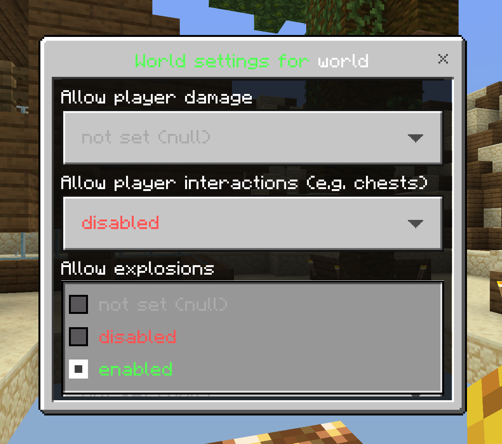

<p align="center">
    
</p>

<br>

<h1 align="center">Worlds</h1>
<p align="center">Easy to use but feature rich World Guard plugin</p>

<br>

<p align="center">
    <a href="https://poggit.pmmp.io/p/Worlds">
        
    </a>
    <a href="https://github.com/pmmp/PocketMine-MP">
        
    </a>
    <a href="https://poggit.pmmp.io/p/Worlds">
        
    </a>
    <a href="https://github.com/survanetwork/Worlds/blob/master/LICENSE">
        
    </a>
    <a href="https://gitter.im/survanetwork/Worlds">
        
    </a>
</p>

##

[• Description](#-description)  
[• Features](#-features)  
[• Usage](#-usage)  
[• Contribution](#-contribution)  
[• License](#%EF%B8%8F-license)

## 📙 Description
Because there was no plugin to manage all aspects of Minecraft: Bedrock Edition servers for each world like WorldGuard on Bukkit, I made Worlds.
With Worlds, you can control events like breaking blocks, dropping items, and many more. And it's getting even more!

If you want to help or you have ideas to make our plugin better, feel free to make a commit or open an issue.
Please report bugs on the issues page on GitHub.

## 🎁 Features
- **CREATE / REMOVE** Create and remove worlds (even special ones with custom world generators)
- **COPY / RENAME** Copy and rename worlds (including all necessary files)
- **LOAD / UNLOAD** Load and unload worlds
- **TELEPORT** Teleport to worlds
- **CONTROL EVERYTHING** Control nearly every event for each world (it's getting more and more).
    - World's gamemode
    - Permission to join a world
    - Block breaking and placing
    - PvP
    - Damage (everything like attacking, fall damage, ...)
    - Explosion
    - Item drop
    - Hunger
    - Fly
    - You have an idea what to add? Feel free to open an issue.
- **DEFAULT VALUES** Set default values for worlds without settings
- **SOPHISTICATED** Easy to use, fast and mostly bug-free.

**NEW** Edit the settings of a world (gamemode, building, damage, and so on) using a super-easy form GUI!



## ⛏ Usage
Worlds is really easy to use. Here is the command syntax:

```
/worlds list
/worlds create <worldname> [type]
/worlds <remove|load|unload|teleport> <worldname>
/worlds <copy|rename> <from> <to>
/worlds set
/worlds set permission <permissionstring>
/worlds set gamemode <survival|creative|adventure|spectator>
/worlds set <build|pvp|damage|interact|explode|drop|hunger|fly> <true|false>
/worlds unset
/worlds unset <permission|gamemode|build|pvp|damage|interact|explode|drop|hunger|fly>
/worlds defaults
/worlds defaults set permission <permissionstring>
/worlds defaults set gamemode <survival|creative|adventure|spectator>
/worlds defaults set <build|pvp|damage|interact|explode|drop|hunger|fly> <true|false>
/worlds defaults unset <permission|gamemode|build|pvp|damage|interact|explode|drop|hunger|fly>
```

For a full list of commands, their usage and a description what they are for, take a look at the [wiki](https://github.com/survanetwork/Worlds/wiki/Commands).

## 🙋‍ Contribution
Feel free to contribute if you have ideas or found an issue.

You can:
- [open an issue](https://github.com/survanetwork/Worlds/issues) (problems, bugs or feature requests)
- [create a pull request](https://github.com/survanetwork/Worlds/pulls) (code contributions like fixed bugs or added features)
- [help translating the plugin](https://github.com/survanetwork/Worlds/tree/master/resources/languages) (create a new language file or correct an existing one)

Please read our **[Contribution Guidelines](CONTRIBUTING.md)** before creating an issue or submitting a pull request.

Many thanks for their support to all contributors!

## 👨‍⚖️ License
[](http://creativecommons.org/licenses/by-nc-sa/4.0/)

[Worlds](https://github.com/survanetwork/Worlds) by [surva network](https://github.com/survanetwork) is licensed under a [Creative Commons Attribution-NonCommercial-ShareAlike 4.0 International License](http://creativecommons.org/licenses/by-nc-sa/4.0/). Permissions beyond the scope of this license may be available on request.
